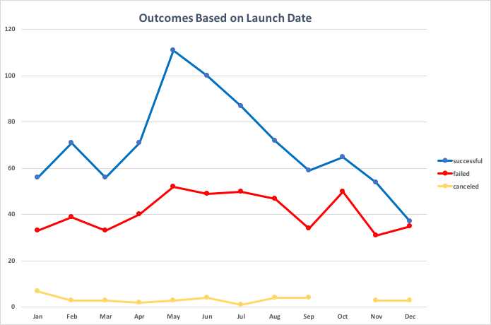
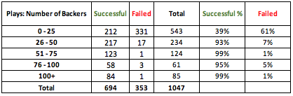

# **<span style="color:green">Kickstarter Crowdfunding Analysis</span>**
## <span style="color:green"> Overview </span>

### Purpose
Louise, a promising new playwright, launched a Kickstarter campaign to finance her new play, *_FEVER_*.  While Louise raised funds quickly (28 days), she fell short of her goal (86% funded).

Now, Louise would like to understand how well other, similar campaigns did to gain insight into why her campaign was not fully funded.

## <span style="color:green"> Analysis and Challenges </span>

### Analysis of Campaign Outcomes Based on Launch Date
Crowdfunding data from over 1,300 campaigns supporting a variety of Theater projects was used to ascertain if any month(s) in particular yielded a higher percentage of successful outcomes.

Utilizing simple Excel formulas, the Unix timestamp for launch date to a traditional date format
```=(((J2/60)/60)/24)+DATE(1970,1,1)```
 then followed by a second conversion of the launch date (Date Created Conversion) to a year format (Years) ```=YEAR(S2)```.  The Parent Category (Theater) and the Years fields are used as filters for a Pivot Table summarizing Outcomes (Successful, Failed, and Canceled) by Launch Month.  Please see Graph 1 and Chart 1 below.

**<span style="color:green">Graph 1: "Theater" Campaign Outcomes Based on Launch Date</span>**



**<span style="color:green">Chart 1: "Theater" Campaign Outcomes Based on Launch Date</span>**


### Analysis of Campaign Outcomes Based on Goals

Data from over 1,000 crowdfunding campaigns supporting "Plays" was analyzed to gain insight into whether these campaigns have a higher success rate at certain goals levels.  

Again using Excel, the "Goal" field was grouped into the following 12 categories using the COUNTIFS function and charted based on "Outcomes" (Successful, Failed, Canceled).  The percentage of total campaigns in each category was calculated using simple division.  Please see Graph 2 and Chart 2 below.


**<span style="color:green">Graph 2: "Plays" Campaign Outcomes Based on Goal Amount</span>** 


**<span style="color:green">Chart 2: "Plays" Campaign Outcomes Based on Goal Amount</span>**


 

### **Challenges and Difficulties** Encountered
There are some minor items to note that caused further inspection of the dataset.  

* Regardless of year, no campaign funding a "Theater" project launched in October was canceled; they all either met their fundraising goals or did not. You can see this depicted in Graph 1 as a gap in the trendline for "Canceled".  Additional steps needed to be taken to confirm that data points were not missing or dropped.

* As per instructions, campaigns with goals of exactly $50,000 were NOT included in the "Goal" categories; which resulted in the omission of 4 data points for this dataset (outcome of "Failed" and a "Goal" of $50,000).  Please refer to the Goal Categories above.  This approach is counterintuitive and so extra attention was needed to ensure instructions were being properly followed. 
  

## <span style="color:green">Results</span>  

### Outcomes Based on Launch Dates

Based on the above analysis involving **launch date**, it is clear that not only is **May** a very popular month to launch campaigns (highest total campaigns launched) but yields the highest percentage of "Successful" campaigns (67% of campaigns launched are "Successful").

Conversely, **December** has the fewest campaigns launched (75) and also has the lowest success rate of 49%.

Louise launched her kickstart campaign in June, which yielded the second-highest number of successful outcomes and the second-highest percentage of successful outcomes (65%).

*Louise did not pick the wrong month to launch her campaign.* 

  
### Outcomes Based on Goal Amount

Graph 2 and Chart 2 indicates that campaigns with **goals** of **less than $1,000** have the highest rate of success, 76%.

Meanwhile, the goal range of **$45,000 - $49,999** had the fewest number of campaigns (1) and the lowest success rate of 0%.

Furthermore, as the goal amount increases its rate of success decreases, until the $30,000 range.  At which point the success rebounds, but then crashes back down at the $45,000+ range. 

Louise's goal for *FEVER* was $2,885; and similar to the launch month, this goal range, **$1,000 - $4,999** reported the second-highest success rate (73%).

*Louise did not set the wrong goal.*

### Limitations of the Dataset  

While the dataset is a well-rounded collection of campaign data involving different genres of projects, different geographies, launch dates, campaign lengths, and fundraising targets, one data point missing is the number of contacts the donation ask was sent to: a participation or conversion rate.  

By collecting the number of potential donors the donation ask was sent to and comparing to actual number of backers, the rate of participation can be calculated (or at least estimated). Does a succssful campaign have a certain participation percentage a fundraiser should target. 

In addition, collecting data on how many times potential donors are contacted ("asked") during the length of the campaign would be helpful.  The frequency of communication can also provide insight into what makes a successful crowdfunding campaign. 

Finally, the data set does not include data on how the campaign was communicated out (via social media, email, or text) nor how many channels (single or multi). 


### Next Steps

Since it appears that Louise launched her campaign in a "successful" month and set an attainable goal, similar to other campaigns that were fully funded, *what was the cause of her shortfall?*

Looking at other factors included in this original data set, like the number of backers or campaign duration, may give Louise better insight into what went wrong.  
  
**Outcome Based on Duration of Campaign**:  
<span style="color:red"> *Was Louise's campaign too short?* </span>  Still working in Excel, a new data point, "Campaign Duration", can be calculated by subtracting the "Date Created Conversion" from the "Date Ended Conversion" and rounding to the nearest whole number (=round([Date Ended]-[Date Created],0). Number of Day ranges can be determined; and with the help of COUNTIFS function, the "Campaign Duration" can be grouped based on "Outcome".

**<span style="color:green">Graph 3: "Plays" Campaign Outcomes Based on Duration (Days)</span>**


**<span style="color:green">Chart 3: "Plays" Campaign Outcomes Based on Duration (Days)</span>**


Based on this quick analysis, it appears that the 1 month range (28 - 31 days) is the most common duration with the highest number of successes, but also the highest number of failures.  


**Outcome Based on Number of Backers**:  
<span style="color:red"> *Did Louise not have enough donor base to support her goal?* </span>  

 Similiar to the Outcome Based on Duration of Campaign chart, the number of backers can be summarized by specified ranges and plotted against outcomes (Successful, Failed, Canceled).  
 
  
    
**<span style="color:green">Graph 4: "Plays" Campaign Outcomes Based on Number of Backers</span>**


**<span style="color:green">Chart 4: "Plays" Campaign Outcomes Based on Number of Backers</span>**
   

Based on this quick analysis, it appears that the fail rate is highest with 0-25 backers; Louise only had 10.

Clearly furter investigation is needed; it appears that Louise may have launched her campaign in an appropriate month and set an appropriate goal and duration of campaign, it fell short on number of backers.  Why this ocurred requires additional data outside the scope of this dataset. 